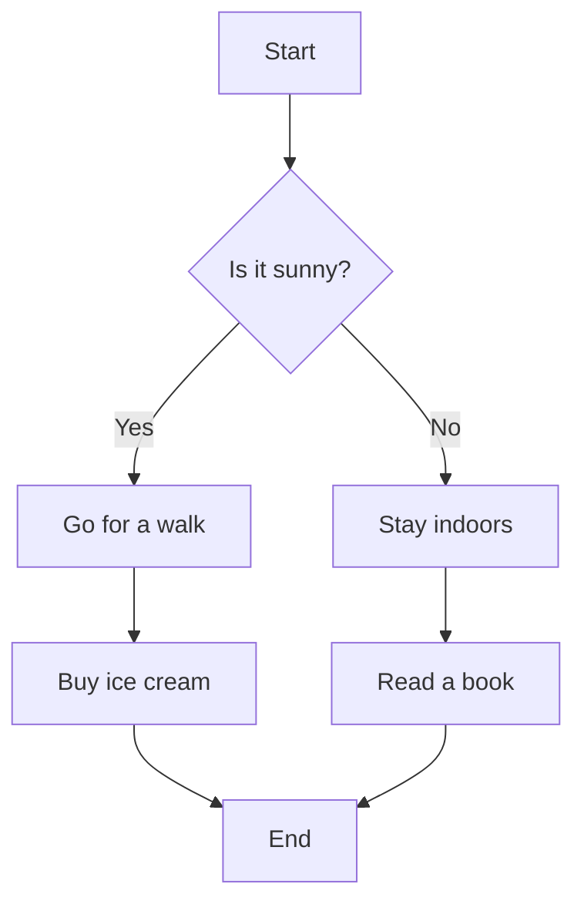

<!--
SPDX-FileCopyrightText: 2026 Logan Mamanakis Logan.Mamanakis@gmail.com>

SPDX-License-Identifier: AGPL-3.0-or-later
-->

# Architecture

Here are some extra docs. With mermaid diagram support.

